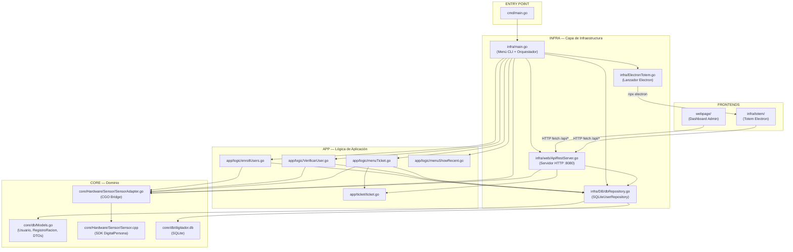
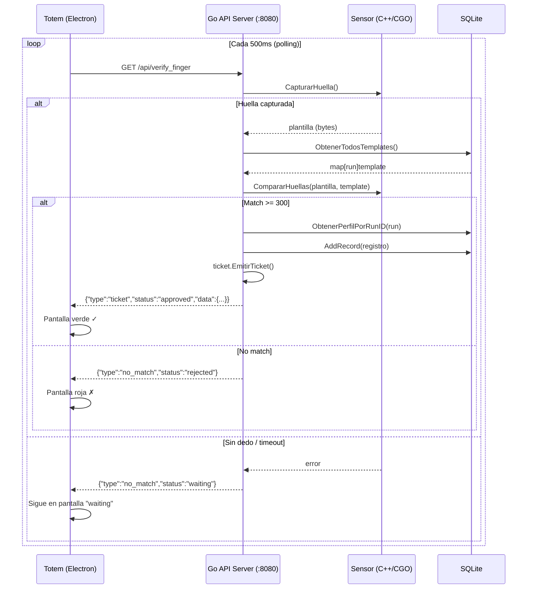
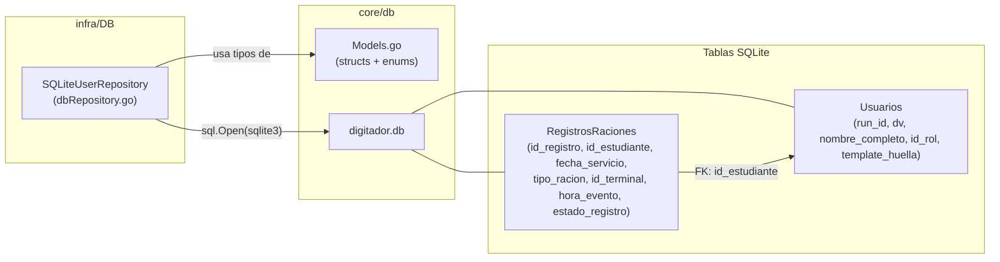
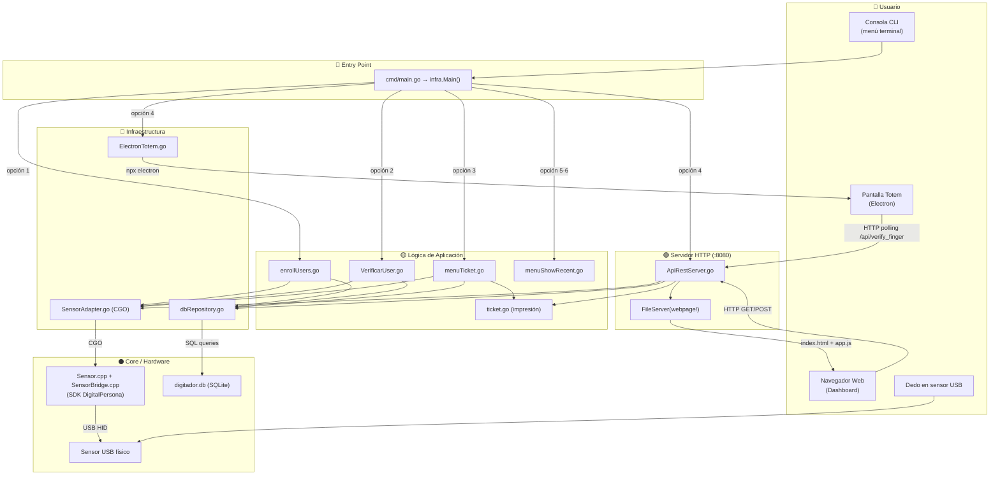

# Reporte de Arquitectura — Sistema Digitador Piamarta

## Diagrama General del Sistema



---

## 1. Conexiones Frontend ↔ Backend

### Dashboard Admin (`webpage/`)

| Archivo | Rol |
|---|---|
| [index.html](file:///c:/Proyectos/Pydigitador/webpage/index.html) | Estructura HTML del panel admin |
| [app.js](file:///c:/Proyectos/Pydigitador/webpage/app.js) | Lógica JS, llamadas a API |
| [style.css](file:///c:/Proyectos/Pydigitador/webpage/style.css) | Estilos del dashboard |

**¿Cómo se conecta al backend?**
El servidor Go en [ApiRestServer.go](file:///c:/Proyectos/Pydigitador/infra/web/ApiRestServer.go) sirve la carpeta `webpage/` como archivos estáticos (línea 207):
```go
mux.Handle("/", http.FileServer(http.Dir("webpage")))
```
Cuando el usuario abre `http://localhost:8080` en el navegador, Go le entrega [index.html](file:///c:/Proyectos/Pydigitador/webpage/index.html). Luego, [app.js](file:///c:/Proyectos/Pydigitador/webpage/app.js) hace llamadas [fetch()](file:///c:/Proyectos/Pydigitador/webpage/app.js#106-115) a las siguientes APIs **relativas** (sin dominio, funciona porque se sirve desde el mismo servidor):

| Endpoint JS | Método | Endpoint Go | Función en dbRepository |
|---|---|---|---|
| `/api/sensor/status` | GET | `/api/Sensor/status` | (inline, verifica `s != nil`) |
| `/api/stats` | GET | `/api/stats` | [GetStats()](file:///c:/Proyectos/Pydigitador/infra/DB/dbRepository.go#342-352) |
| `/api/recent` | GET | `/api/recent` | [GetRecentRecords(20)](file:///c:/Proyectos/Pydigitador/infra/DB/dbRepository.go#298-341) |
| `/api/students` | GET | `GET /api/students` | [GetAllUsers()](file:///c:/Proyectos/Pydigitador/infra/DB/dbRepository.go#118-160) |
| `/api/students` | POST | `POST /api/students` | [AddStudent()](file:///c:/Proyectos/Pydigitador/infra/DB/dbRepository.go#68-72) |
| `/api/students/{run}/stats` | GET | `GET /api/students/{run}/stats` | [GetStudentStats(run)](file:///c:/Proyectos/Pydigitador/infra/DB/dbRepository.go#393-401) |
| `/api/students/{run}/history` | GET | `GET /api/students/{run}/history` | [GetStudentHistory(run)](file:///c:/Proyectos/Pydigitador/infra/DB/dbRepository.go#353-392) |
| `/api/students/{run}` | PUT | `PUT /api/students/{run}` | [UpdateStudent()](file:///c:/Proyectos/Pydigitador/infra/DB/dbRepository.go#73-77) |
| `/api/students/{run}` | DELETE | `DELETE /api/students/{run}` | [DeleteStudentByRun(run)](file:///c:/Proyectos/Pydigitador/infra/DB/dbRepository.go#78-82) |
| `/api/export/records` | GET | ⚠️ **NO IMPLEMENTADO** | — |
| `/api/export/students` | GET | ⚠️ **NO IMPLEMENTADO** | — |

> [!WARNING]
> **Inconsistencia detectada:** El JS en [app.js](file:///c:/Proyectos/Pydigitador/webpage/app.js) llama a `/api/sensor/status` (minúscula) pero el endpoint en Go está registrado como `/api/Sensor/status` (mayúscula). Esto puede funcionar o no dependiendo del SO, pero debería unificarse.

> [!WARNING]
> **Endpoints faltantes:** Los botones "Exportar a Excel" en el Dashboard llaman a `/api/export/records` y `/api/export/students`, pero estos endpoints **no están implementados** en [ApiRestServer.go](file:///c:/Proyectos/Pydigitador/infra/web/ApiRestServer.go). Harán que el botón muestre error.

---

### Totem Electron (`infra/totem/`)

| Archivo | Rol |
|---|---|
| [main.js](file:///c:/Proyectos/Pydigitador/infra/totem/main.js) | Proceso principal Electron (crea ventana) |
| [index.html](file:///c:/Proyectos/Pydigitador/infra/totem/index.html) | UI del tótem (4 pantallas: waiting, processing, approved, rejected) |
| [renderer.js](file:///c:/Proyectos/Pydigitador/infra/totem/renderer.js) | Lógica de polling y verificación de huella |

**¿Cómo se conecta al backend?**
A diferencia del Dashboard (que usa rutas relativas), el Totem se conecta por **URL absoluta**:
```javascript
const API_URL = 'http://localhost:8080';  // renderer.js línea 3
```

**Flujo de operación del Totem:**



El Totem solo usa **1 endpoint**: `/api/verify_finger`. Todo el flujo de verificación, registro en DB e impresión de ticket se ejecuta del lado del servidor Go.

**¿Cómo se lanza el Totem?**
Desde el menú CLI (opción 4), [ElectronTotem.go](file:///c:/Proyectos/Pydigitador/infra/ElectronTotem.go) ejecuta:
```go
cmd := exec.Command("npx", "electron", "./infra/totem")
```
Esto abre Electron que carga `index.html` del totem.

> [!NOTE]
> La ruta `"./infra/totem"` en `ElectronTotem.go` tiene el **mismo problema** que tenía la DB: depende del directorio de trabajo actual. Debería ajustarse dinámicamente como se hizo con `dbPath`.

---

## 2. Capa de Base de Datos

### Flujo de datos



### Funciones del repositorio ([dbRepository.go](file:///c:/Proyectos/Pydigitador/infra/DB/dbRepository.go))

| Función | Descripción | Usado por |
|---|---|---|
| `NewSQLiteUserRepository(path)` | Abre la conexión SQLite | `infra/main.go` |
| `SaveUser(user)` | INSERT OR REPLACE en Usuarios | Enrolamiento |
| `AddStudent(user)` | Wrapper de SaveUser | API POST |
| `UpdateStudent(user)` | Wrapper de SaveUser | API PUT |
| `DeleteStudentByRun(run)` | DELETE por RUN | API DELETE |
| `GetUser(runID)` | Perfil completo de 1 usuario | Lógica de verificación |
| `GetAllUsers()` | Todos los usuarios | API GET, Dashboard |
| `ObtenerTodosTemplates()` | Map de run→huella | Verificación de identidad |
| `GuardarRegistroRacion(reg)` | Inserta ticket en DB | Flujo de ticket |
| `AddRecord(record)` | Wrapper de GuardarRegistroRacion | API verify_finger |
| `GetRecentRecords(limit)` | JOIN Usuarios+Raciones (recientes) | Dashboard "Registros Recientes" |
| `GetStats()` | Conteo global desayunos/almuerzos | Dashboard stats |
| `GetStudentStats(run)` | Stats por alumno | Modal de estadísticas |
| `GetStudentHistory(run)` | Historial de raciones de 1 alumno | Modal detalle |
| `ObtenerPerfilPorRunID(run)` | → `PerfilEstudiante` | Verificación en Totem |
| `BorrarRegistro()` | Borra último registro (LIFO) | Menú CLI |
| `BorrarUsuario()` | Borra último usuario (LIFO) | Menú CLI |
| `BorrarTodo()` | Limpia toda la DB | Menú CLI (opción 10) |
| `SincronizarRegistros()` | Marca pendientes como sincronizados | API sync |
| `Close()` | Cierra conexión | defer en main |

---

## 3. Mapa Completo de Conexiones del Sistema



---

## Resumen de Observaciones

### ✅ Lo que funciona bien
- Arquitectura hexagonal clara: `core/` (dominio) → `app/` (lógica) → `infra/` (infra)
- El servidor API unifica el acceso a datos para ambos frontends
- El repositorio SQLite centraliza todas las operaciones de BD
- El sensor C++ se integra limpiamente via CGO

### ⚠️ Problemas y riesgos detectados

| # | Problema | Impacto | Archivos |
|---|---|---|---|
| 1 | **Ruta del sensor/totem hardcodeada** (`"./infra/totem"`) | Mismo problema que la DB: falla si el exe se ejecuta desde otra carpeta | `ElectronTotem.go` |
| 2 | **Case mismatch en endpoint sensor:** JS llama `/api/sensor/status`, Go registra `/api/Sensor/status` | Puede fallar silenciosamente | `app.js` ↔ `ApiRestServer.go` |
| 3 | **Endpoints de exportación no implementados** (`/api/export/records`, `/api/export/students`) | Botón "Exportar a Excel" no funciona | `app.js` L607, L637 |
| 4 | **Ruta de `webpage/` también es relativa** en `FileServer(http.Dir("webpage"))` | Dashboard no se serviría si ejecutas desde otra carpeta | `ApiRestServer.go` L207 |
| 5 | **Comentarios legacy mencionan C++** en el totem (`main.js` dice "servidor C++") | Confusión, el servidor ahora es Go | `main.js` |
